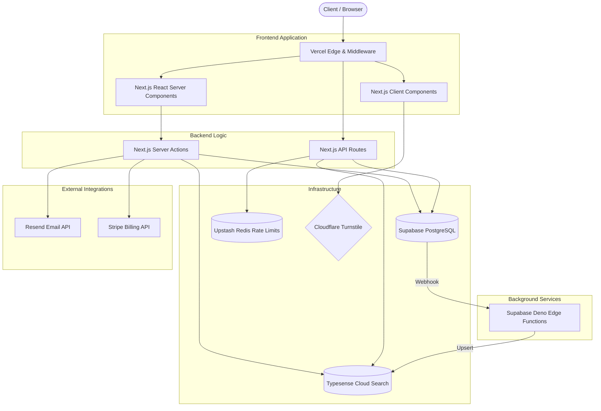

# System Architecture

Hire Car utilizes a modern, serverless architecture centered around Next.js App Router, Supabase (PostgreSQL), and Typesense Cloud.

## High-Level System Overview

## Frontend Architecture
- **Rendering Model**: The application heavily favors React Server Components (RSC) to fetch data natively on the server without shipping Javascript to the client. Interactive UI components (e.g., Image Galleries, Search Filters) are isolated into Client Components (`"use client"`).
- **Caching**: The public SEO pages (`/cars/[slug]`, `/locations/[city]`) utilize Incremental Static Regeneration (ISR) to cache database-heavy queries at the Vercel Edge.

## Backend/API Architecture
- **Data Mutations**: Prefer Next.js Server Actions over API routes for internal data mutations (e.g., submitting a lead, updating a vehicle).
- **Public Endpoints**: `/api/*` route handlers are strictly reserved for external webhooks (Stripe), public unauthenticated access (Health, Search), or third-party integrations.

## Auth Flow
- Sessions are managed by Supabase Auth (JWT). 
- Edge `middleware.ts` intercepts all requests to `/admin`, `/customer`, and `/vendor` and reads the session cookie to enforce Role-Based Access Control before hitting the server component.

## Search Flow
1. A vendor creates a vehicle in the `vehicles` table.
2. A Postgres Database Trigger fires an async webhook to a Supabase Deno Edge Function (`search-index-worker`).
3. The worker upserts the sanitized vehicle data into the Typesense Cloud index.
4. Users querying the frontend hit `/api/search` which directly queries the fast Typesense index. If Typesense is offline, the API falls back to a PostgreSQL `.ilike()` query gracefully.

## Storage Flow
Vehicle images are uploaded to the Supabase `vehicle-images` bucket. The bucket is configured as public to allow CDN-level caching without generating signed URLs, maximizing LCP performance.
